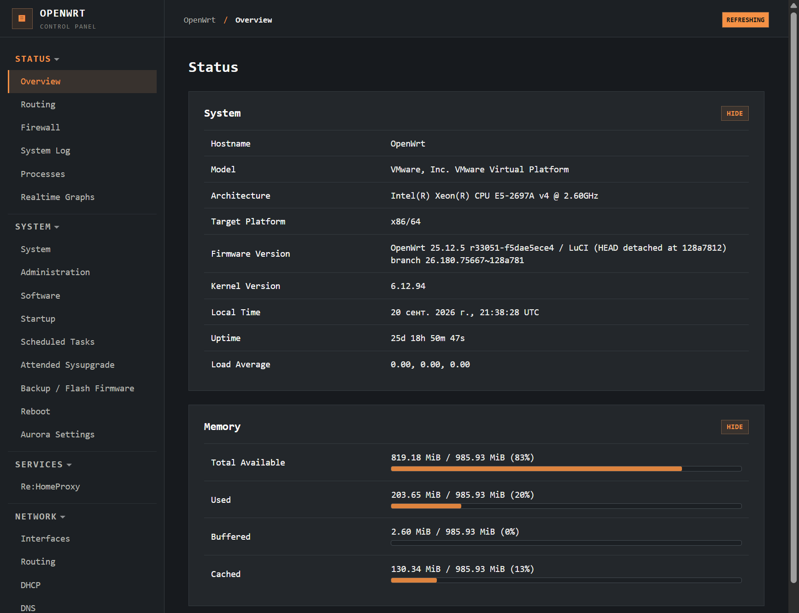
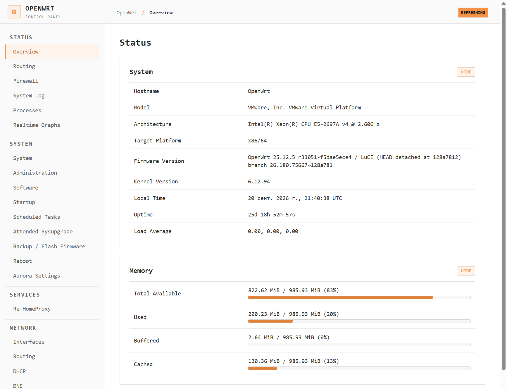

# Termix-inspired LuCI theme

A responsive LuCI theme with a terminal-inspired palette and a sidebar layout.
It offers dark, light, and system color modes, twelve accent presets, and a
custom HEX accent. This is an independent community project inspired by the
appearance of Termix. It is not affiliated with Termix, and it contains no
Termix code or assets.

## Screenshots

### Dark mode



### Light mode



## Compatibility

The theme was developed and tested with OpenWrt 25.12.5 and LuCI
26.180.75667~128a781. OpenWrt 25.12 and newer use APK packages; older
releases require an IPK built with the corresponding SDK. Other release and
LuCI combinations have not yet been tested.

## Install

Once a release is published, download the APK for your OpenWrt release from
the [Releases page](https://github.com/konstantinhidirov/luci-theme-termix/releases)
and install it on the router:

```sh
apk add --allow-untrusted ./luci-theme-termix-*.apk
```

The package registers **Termix** as an available LuCI theme without changing
the selected theme. To select it, open **System → System → Language and Style**,
or use SSH:

```sh
uci set luci.main.mediaurlbase='/luci-static/termix'
uci commit luci
```

Reload the browser after switching themes. If the interface cannot be used,
restore the default theme over SSH:

```sh
uci set luci.main.mediaurlbase='/luci-static/bootstrap'
uci commit luci
```

These commands change only the LuCI appearance. They do not change networking
or services.

## Appearance settings

Open **System → Termix Theme** to choose a color mode and accent. Select
**Custom** to enter a `#RRGGBB` color. Apply the changes and reload the page.
The theme starts in dark mode with an orange accent. Settings are stored in
`/etc/config/termix` and apply to the LuCI interface on this device.

## Build an APK

Use the OpenWrt SDK matching the target release and platform. Place this
repository at `package/luci-theme-termix` inside the SDK, install the LuCI
feed, and build the package:

```sh
./scripts/feeds update -a
./scripts/feeds install -a
make defconfig
make package/luci-theme-termix/compile V=s
```

The resulting APK is under `bin/packages/`. Build from an unprivileged Linux
account in a directory without spaces. APK assets belong in a tagged release;
the Git repository holds the source.

## Repository layout

- `htdocs/luci-static/termix/` contains CSS, JavaScript, and image assets.
- `ucode/template/themes/termix/` contains the LuCI templates.
- `root/etc/uci-defaults/` registers the theme after installation.
- `root/etc/config/termix` contains the default appearance settings.
- `root/usr/share/luci/menu.d/` and `root/usr/share/rpcd/acl.d/` register the settings page and its permissions.
- `baseline/` contains original upstream Bootstrap files for comparison.
- `KNOWN_ISSUES.md` tracks follow-up UI fixes.

## License and attribution

Licensed under Apache License 2.0. Adapted LuCI Bootstrap templates and styles
come from the OpenWrt LuCI project. See [NOTICE](NOTICE) and [LICENSE](LICENSE).
